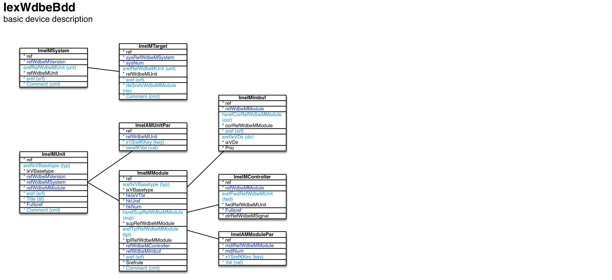

Basic device description ``[IexWdbeBdd]``
===

Schema
---

<em>Figure 1: Basic device description schema - table columns in light blue are part of the input file, table columns in dark blue are inferred</em>

Structure
---

[//]: # (IP structure - BEGIN)

 &nbsp;&nbsp;&nbsp;&nbsp;\+ System [``[ImeIMSystem]``](#1-system-imeimsystem)
 &nbsp;&nbsp;&nbsp;&nbsp;&nbsp;&nbsp;&nbsp;&nbsp;\- Target [``[ImeIMTarget]``](#11-target-imeimtarget)
 &nbsp;&nbsp;&nbsp;&nbsp;\+ Unit [``[ImeIMUnit]``](#2-unit-imeimunit)
 &nbsp;&nbsp;&nbsp;&nbsp;&nbsp;&nbsp;&nbsp;&nbsp;\- Parameters [``[ImeIAMUnitPar]``](#21-parameters-imeiamunitpar)
 &nbsp;&nbsp;&nbsp;&nbsp;&nbsp;&nbsp;&nbsp;&nbsp;\+ Module [``[ImeIMModule]``](#22-module-imeimmodule)
 &nbsp;&nbsp;&nbsp;&nbsp;&nbsp;&nbsp;&nbsp;&nbsp;&nbsp;&nbsp;&nbsp;&nbsp;\- Parameters [``[ImeIAMModulePar]``](#221-parameters-imeiammodulepar)
 &nbsp;&nbsp;&nbsp;&nbsp;&nbsp;&nbsp;&nbsp;&nbsp;&nbsp;&nbsp;&nbsp;&nbsp;\- Controller [``[ImeIMController]``](#222-controller-imeimcontroller)
 &nbsp;&nbsp;&nbsp;&nbsp;&nbsp;&nbsp;&nbsp;&nbsp;&nbsp;&nbsp;&nbsp;&nbsp;\- Inter-module buffer [``[ImeIMImbuf]``](#223-intermodule-buffer-imeimimbuf)

[//]: # (IP structure - END)

Details
---

### 1 System ``[ImeIMSystem]``

[//]: # (IP ImeIMSystem.superUse - RBEGIN)

Use: full model only - a system is one possible hierarchical combination of units.

[//]: # (IP ImeIMSystem.superUse - REND)

[//]: # (IP ImeIMSystem.columns - BEGIN)

Column|Content|
-|-|
srefRefWdbeMUnit (string)|root unit|
sref (string)|identifier|
Comment (string)|comment|

[//]: # (IP ImeIMSystem.columns - END)

### 1.1 Target ``[ImeIMTarget]``

[//]: # (IP ImeIMTarget.superUse - RBEGIN)

Super import: system (1:N)

Use: full model only - a target combines a system's unit with the routing to be followed in order to reach it.

[//]: # (IP ImeIMTarget.superUse - REND)

[//]: # (IP ImeIMTarget.columns - RBEGIN)

Column|Content|
-|-|
srefRefWdbeMUnit (string)|unit|
sref (string)|identifier|
rteSrefsWdbeMModule (string)|routing - sequence of other units' forwarding controllers starting from root unit|
Comment (string)|comment|

[//]: # (IP ImeIMTarget.columns - REND)

### 2 Unit ``[ImeIMUnit]``

[//]: # (IP ImeIMUnit.superUse - RBEGIN)

Use: a unit typically represents one PCB which can be addressed individually from the host.

[//]: # (IP ImeIMUnit.superUse - REND)

[//]: # (IP ImeIMUnit.columns - BEGIN)

Column|Content|
-|-|
srefIxVBasetype (string)|type fpga: FPGA-based mcu: microcontroller-based oth: other|
sref (string)|identifier|
Title (string)|name|
Comment (string)|comment|

[//]: # (IP ImeIMUnit.columns - END)

### 2.1 Parameters ``[ImeIAMUnitPar]``

[//]: # (IP ImeIAMUnitPar.superUse - RBEGIN)

Super import: unit (1:N)

Use: unit parameter (key/value pair).

[//]: # (IP ImeIAMUnitPar.superUse - REND)

[//]: # (IP ImeIAMUnitPar.columns - RBEGIN)

Column|Content|
-|-|
x1SrefKKey (string)|key mnf: manufacturer partno: part number toolch: tool chain _- required for FPGA-based units_|
osrefKVal (string)|value _[key:mnf]_ mchp: Microchip xlnx: Xilinx _[key:partno]_ pic24f16kl402/ss: PIC24 16MHz SSOP28 xc3s100e-vqg100: Spartan-3E 100 QFP100 xc3s100e-cpg132: Spartan-3E 100 BGA132 xc3s250e-4vqg100: Spartan-3E 250 QFP100 xc3s500e-4vqg100: Spartan-3E 500 QFP100 xc3s500e-fgg320: Spartan-3E 500 BGA320 xc7a35t-1cpg236: Artix-7 35 BGA236 xc7a100t-2fgg484c: Artix-7 100 BGA484 xc7z020-clg484-1: Zynq 7020 BGA484 xczu3eg-sfva625-1: Zynq UltraScale+ EG BGA625 _[key:toolch]_ ise: Xilinx ISE mplab: Microchip MPLAB X vivado: Xilinx Vivado vivzynq: Xilinx Vivado for Zynq|

[//]: # (IP ImeIAMUnitPar.columns - REND)

### 2.2 Module ``[ImeIMModule]``

[//]: # (IP ImeIMModule.superUse - RBEGIN)

Super import: unit (1:N)

Use: FPGA-based units only - equivalent to VHDL module.

[//]: # (IP ImeIMModule.superUse - REND)

[//]: # (IP ImeIMModule.columns - BEGIN)

Column|Content|
-|-|
srefIxVBasetype (string)|type top: top hostif: host interface ehostif: easy model host interface cmdbus: command bus controller cmdinv: command invocation buffer cmdret: command return buffer imbuf: inter-module buffer mnfcore: manufacturer core mnfprim: manufacturer primitive ctr: controller fwdctr: forwarding controller ectr: easy model controller wrp: wrapper oth: other|
hsrefSupRefWdbeMModule (string)|super module|
srefTplRefWdbeMModule (string)|template|
sref (string)|identifier|
Comment (string)|comment|

[//]: # (IP ImeIMModule.columns - END)

### 2.2.1 Parameters ``[ImeIAMModulePar]``

[//]: # (IP ImeIAMModulePar.superUse - RBEGIN)

Super import: module (1:N)

Use: customize template-based modules based (key/value pairs).

[//]: # (IP ImeIAMModulePar.superUse - REND)

[//]: # (IP ImeIAMModulePar.columns - BEGIN)

Column|Content|
-|-|
x1SrefKKey (string)|key|
Val (string)|value|

[//]: # (IP ImeIAMModulePar.columns - END)

### 2.2.2 Controller ``[ImeIMController]``

[//]: # (IP ImeIMController.superUse - BEGIN)

Super import: module (1:1)

Use: attach to forwarding controller to state the unit it is forwarding to.

[//]: # (IP ImeIMController.superUse - END)

[//]: # (IP ImeIMController.columns - RBEGIN)

Column|Content|
-|-|
srefFwdRefWdbeMUnit (string)|unit forwarding to|

[//]: # (IP ImeIMController.columns - REND)

### 2.2.3 Inter-module buffer ``[ImeIMImbuf]``

[//]: # (IP ImeIMImbuf.superUse - RBEGIN)

Super import: module (1:1)

Use: attach to inter-module buffer to state the corresponding module and data flow direction.

[//]: # (IP ImeIMImbuf.superUse - REND)

[//]: # (IP ImeIMImbuf.columns - BEGIN)

Column|Content|
-|-|
hsrefCorRefWdbeMModule (string)|corresponding module|
sref (string)|identifier|
srefIxVDir (string)|direction in: input out: output|

[//]: # (IP ImeIMImbuf.columns - END)

<em>Markdown for WhizniumDBE 0.9.42 auto-generated (what else ;-) ) by WhizniumSBE on 16 Sep 2018</em>
