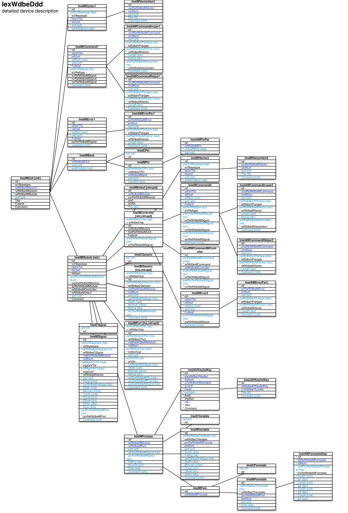

Detailed device description ``[IexWdbeDdd]``
===

Schema
---

<em>Figure 1: Detailed device description schema - table columns in light blue are part of the input file, table columns in dark blue are inferred</em>

Structure
---

[//]: # (IP structure - BEGIN)

 &nbsp;&nbsp;&nbsp;&nbsp;\+ Unit [``[ImeIMUnit]``](#1-unit-imeimunit)
 &nbsp;&nbsp;&nbsp;&nbsp;&nbsp;&nbsp;&nbsp;&nbsp;\+ I/O bank [``[ImeIMBank]``](#11-io-bank-imeimbank)
 &nbsp;&nbsp;&nbsp;&nbsp;&nbsp;&nbsp;&nbsp;&nbsp;&nbsp;&nbsp;&nbsp;&nbsp;\- TblWdbeCPin [``[ImeICPin]``](#111-tblwdbecpin-imeicpin)
 &nbsp;&nbsp;&nbsp;&nbsp;&nbsp;&nbsp;&nbsp;&nbsp;&nbsp;&nbsp;&nbsp;&nbsp;\+ Pin [``[ImeIMPin]``](#112-pin-imeimpin)
 &nbsp;&nbsp;&nbsp;&nbsp;&nbsp;&nbsp;&nbsp;&nbsp;&nbsp;&nbsp;&nbsp;&nbsp;&nbsp;&nbsp;&nbsp;&nbsp;\- Parameters [``[ImeIAMPinPar]``](#1121-parameters-imeiampinpar)
 &nbsp;&nbsp;&nbsp;&nbsp;&nbsp;&nbsp;&nbsp;&nbsp;\+ Command [``[ImeIMCommand1]``](#12-command-imeimcommand1)
 &nbsp;&nbsp;&nbsp;&nbsp;&nbsp;&nbsp;&nbsp;&nbsp;&nbsp;&nbsp;&nbsp;&nbsp;\- Invocation parameters [``[ImeIAMCommandInvpar1]``](#121-invocation-parameters-imeiamcommandinvpar1)
 &nbsp;&nbsp;&nbsp;&nbsp;&nbsp;&nbsp;&nbsp;&nbsp;&nbsp;&nbsp;&nbsp;&nbsp;\- Return parameters [``[ImeIAMCommandRetpar1]``](#122-return-parameters-imeiamcommandretpar1)
 &nbsp;&nbsp;&nbsp;&nbsp;&nbsp;&nbsp;&nbsp;&nbsp;\+ Error [``[ImeIMError1]``](#13-error-imeimerror1)
 &nbsp;&nbsp;&nbsp;&nbsp;&nbsp;&nbsp;&nbsp;&nbsp;&nbsp;&nbsp;&nbsp;&nbsp;\- Parameters [``[ImeIAMErrorPar1]``](#131-parameters-imeiamerrorpar1)
 &nbsp;&nbsp;&nbsp;&nbsp;&nbsp;&nbsp;&nbsp;&nbsp;\+ Module [``[ImeIMModule]``](#14-module-imeimmodule)
 &nbsp;&nbsp;&nbsp;&nbsp;&nbsp;&nbsp;&nbsp;&nbsp;&nbsp;&nbsp;&nbsp;&nbsp;\- TblWdbeCGeneric [``[ImeICGeneric]``](#141-tblwdbecgeneric-imeicgeneric)
 &nbsp;&nbsp;&nbsp;&nbsp;&nbsp;&nbsp;&nbsp;&nbsp;&nbsp;&nbsp;&nbsp;&nbsp;\- TblWdbeCPort [``[ImeICPort]``](#142-tblwdbecport-imeicport)
 &nbsp;&nbsp;&nbsp;&nbsp;&nbsp;&nbsp;&nbsp;&nbsp;&nbsp;&nbsp;&nbsp;&nbsp;\- TblWdbeCSignal [``[ImeICSignal]``](#143-tblwdbecsignal-imeicsignal)
 &nbsp;&nbsp;&nbsp;&nbsp;&nbsp;&nbsp;&nbsp;&nbsp;&nbsp;&nbsp;&nbsp;&nbsp;\+ Controller [``[ImeIMController]``](#144-controller-imeimcontroller)
 &nbsp;&nbsp;&nbsp;&nbsp;&nbsp;&nbsp;&nbsp;&nbsp;&nbsp;&nbsp;&nbsp;&nbsp;&nbsp;&nbsp;&nbsp;&nbsp;\+ Command [``[ImeIMCommand2]``](#1441-command-imeimcommand2)
 &nbsp;&nbsp;&nbsp;&nbsp;&nbsp;&nbsp;&nbsp;&nbsp;&nbsp;&nbsp;&nbsp;&nbsp;&nbsp;&nbsp;&nbsp;&nbsp;&nbsp;&nbsp;&nbsp;&nbsp;\- Invocation parameters [``[ImeIAMCommandInvpar2]``](#14411-invocation-parameters-imeiamcommandinvpar2)
 &nbsp;&nbsp;&nbsp;&nbsp;&nbsp;&nbsp;&nbsp;&nbsp;&nbsp;&nbsp;&nbsp;&nbsp;&nbsp;&nbsp;&nbsp;&nbsp;&nbsp;&nbsp;&nbsp;&nbsp;\- Return parameters [``[ImeIAMCommandRetpar2]``](#14412-return-parameters-imeiamcommandretpar2)
 &nbsp;&nbsp;&nbsp;&nbsp;&nbsp;&nbsp;&nbsp;&nbsp;&nbsp;&nbsp;&nbsp;&nbsp;&nbsp;&nbsp;&nbsp;&nbsp;\+ Error [``[ImeIMError2]``](#1442-error-imeimerror2)
 &nbsp;&nbsp;&nbsp;&nbsp;&nbsp;&nbsp;&nbsp;&nbsp;&nbsp;&nbsp;&nbsp;&nbsp;&nbsp;&nbsp;&nbsp;&nbsp;&nbsp;&nbsp;&nbsp;&nbsp;\- Parameters [``[ImeIAMErrorPar2]``](#14421-parameters-imeiamerrorpar2)
 &nbsp;&nbsp;&nbsp;&nbsp;&nbsp;&nbsp;&nbsp;&nbsp;&nbsp;&nbsp;&nbsp;&nbsp;&nbsp;&nbsp;&nbsp;&nbsp;\+ Vector [``[ImeIMVector2]``](#1443-vector-imeimvector2)
 &nbsp;&nbsp;&nbsp;&nbsp;&nbsp;&nbsp;&nbsp;&nbsp;&nbsp;&nbsp;&nbsp;&nbsp;&nbsp;&nbsp;&nbsp;&nbsp;&nbsp;&nbsp;&nbsp;&nbsp;\- Vector item [``[ImeIMVectoritem2]``](#14431-vector-item-imeimvectoritem2)
 &nbsp;&nbsp;&nbsp;&nbsp;&nbsp;&nbsp;&nbsp;&nbsp;&nbsp;&nbsp;&nbsp;&nbsp;&nbsp;&nbsp;&nbsp;&nbsp;\- TblWdbeRMCommandMController [``[ImeIRMCommandMController]``](#1444-tblwdbermcommandmcontroller-imeirmcommandmcontroller)
 &nbsp;&nbsp;&nbsp;&nbsp;&nbsp;&nbsp;&nbsp;&nbsp;&nbsp;&nbsp;&nbsp;&nbsp;\- Generic [``[ImeIMGeneric]``](#145-generic-imeimgeneric)
 &nbsp;&nbsp;&nbsp;&nbsp;&nbsp;&nbsp;&nbsp;&nbsp;&nbsp;&nbsp;&nbsp;&nbsp;\- Inter-module buffer [``[ImeIMImbuf]``](#146-intermodule-buffer-imeimimbuf)
 &nbsp;&nbsp;&nbsp;&nbsp;&nbsp;&nbsp;&nbsp;&nbsp;&nbsp;&nbsp;&nbsp;&nbsp;\- Port [``[ImeIMPort]``](#147-port-imeimport)
 &nbsp;&nbsp;&nbsp;&nbsp;&nbsp;&nbsp;&nbsp;&nbsp;&nbsp;&nbsp;&nbsp;&nbsp;\+ Process [``[ImeIMProcess]``](#148-process-imeimprocess)
 &nbsp;&nbsp;&nbsp;&nbsp;&nbsp;&nbsp;&nbsp;&nbsp;&nbsp;&nbsp;&nbsp;&nbsp;&nbsp;&nbsp;&nbsp;&nbsp;\+ Keys [``[ImeIAVKeylistKey]``](#1481-keys-imeiavkeylistkey)
 &nbsp;&nbsp;&nbsp;&nbsp;&nbsp;&nbsp;&nbsp;&nbsp;&nbsp;&nbsp;&nbsp;&nbsp;&nbsp;&nbsp;&nbsp;&nbsp;&nbsp;&nbsp;&nbsp;&nbsp;\- Name and comment by locale [``[ImeIJAVKeylistKey]``](#14811-name-and-comment-by-locale-imeijavkeylistkey)
 &nbsp;&nbsp;&nbsp;&nbsp;&nbsp;&nbsp;&nbsp;&nbsp;&nbsp;&nbsp;&nbsp;&nbsp;&nbsp;&nbsp;&nbsp;&nbsp;\- TblWdbeCVariable [``[ImeICVariable]``](#1482-tblwdbecvariable-imeicvariable)
 &nbsp;&nbsp;&nbsp;&nbsp;&nbsp;&nbsp;&nbsp;&nbsp;&nbsp;&nbsp;&nbsp;&nbsp;&nbsp;&nbsp;&nbsp;&nbsp;\+ Finite state machine [``[ImeIMFsm]``](#1483-finite-state-machine-imeimfsm)
 &nbsp;&nbsp;&nbsp;&nbsp;&nbsp;&nbsp;&nbsp;&nbsp;&nbsp;&nbsp;&nbsp;&nbsp;&nbsp;&nbsp;&nbsp;&nbsp;&nbsp;&nbsp;&nbsp;&nbsp;\- TblWdbeCFsmstate [``[ImeICFsmstate]``](#14831-tblwdbecfsmstate-imeicfsmstate)
 &nbsp;&nbsp;&nbsp;&nbsp;&nbsp;&nbsp;&nbsp;&nbsp;&nbsp;&nbsp;&nbsp;&nbsp;&nbsp;&nbsp;&nbsp;&nbsp;&nbsp;&nbsp;&nbsp;&nbsp;\+ FSM state [``[ImeIMFsmstate]``](#14832-fsm-state-imeimfsmstate)
 &nbsp;&nbsp;&nbsp;&nbsp;&nbsp;&nbsp;&nbsp;&nbsp;&nbsp;&nbsp;&nbsp;&nbsp;&nbsp;&nbsp;&nbsp;&nbsp;&nbsp;&nbsp;&nbsp;&nbsp;&nbsp;&nbsp;&nbsp;&nbsp;\- Steppings [``[ImeIAMFsmstateStep]``](#148321-steppings-imeiamfsmstatestep)
 &nbsp;&nbsp;&nbsp;&nbsp;&nbsp;&nbsp;&nbsp;&nbsp;&nbsp;&nbsp;&nbsp;&nbsp;&nbsp;&nbsp;&nbsp;&nbsp;\- Variable [``[ImeIMVariable]``](#1484-variable-imeimvariable)
 &nbsp;&nbsp;&nbsp;&nbsp;&nbsp;&nbsp;&nbsp;&nbsp;&nbsp;&nbsp;&nbsp;&nbsp;\- Signal [``[ImeIMSignal]``](#149-signal-imeimsignal)
 &nbsp;&nbsp;&nbsp;&nbsp;&nbsp;&nbsp;&nbsp;&nbsp;\+ Vector [``[ImeIMVector1]``](#15-vector-imeimvector1)
 &nbsp;&nbsp;&nbsp;&nbsp;&nbsp;&nbsp;&nbsp;&nbsp;&nbsp;&nbsp;&nbsp;&nbsp;\- Vector item [``[ImeIMVectoritem1]``](#151-vector-item-imeimvectoritem1)

[//]: # (IP structure - END)

Details
---

### 1 Unit

[//]: # (IP ImeIMUnit.superUse - BEGIN)

Use:

[//]: # (IP ImeIMUnit.superUse - END)

[//]: # (IP ImeIMUnit.columns - BEGIN)

Column|Content|
-|-|
sref (string)|identifier|

[//]: # (IP ImeIMUnit.columns - END)

### 1.1 I/O bank

[//]: # (IP ImeIMBank.superUse - BEGIN)

Super import: unit (1:N)

Use:

[//]: # (IP ImeIMBank.superUse - END)

[//]: # (IP ImeIMBank.columns - BEGIN)

Column|Content|
-|-|
sref (string)|identifier|
srefKVoltstd (string)|voltage standard _1v2: 1.2V _1v8: 1.8V _2v5: 2.5V _3v3: 3.3V|

[//]: # (IP ImeIMBank.columns - END)

### 1.1.1 TblWdbeCPin

[//]: # (IP ImeICPin.superUse - BEGIN)

Super import: I/O bank (1:N)

Use:

[//]: # (IP ImeICPin.superUse - END)

[//]: # (IP ImeICPin.columns - BEGIN)

Column|Content|
-|-|
iref (ubigint)|ref|

[//]: # (IP ImeICPin.columns - END)

### 1.1.2 Pin

[//]: # (IP ImeIMPin.superUse - BEGIN)

Super import: I/O bank (1:N)

Use:

[//]: # (IP ImeIMPin.superUse - END)

[//]: # (IP ImeIMPin.columns - BEGIN)

Column|Content|
-|-|
irefRefWdbeCPin (ubigint)|TblWdbeCPin|
sref (string)|identifier|
Location (string)|location|

[//]: # (IP ImeIMPin.columns - END)

### 1.1.2.1 Parameters

[//]: # (IP ImeIAMPinPar.superUse - BEGIN)

Super import: pin (1:N)

Use:

[//]: # (IP ImeIAMPinPar.superUse - END)

[//]: # (IP ImeIAMPinPar.columns - BEGIN)

Column|Content|
-|-|
x1SrefKKey (string)|key fclk: clock frequency [kHz] lvds: low-voltage differential signal noclkdr: no clock dedicated route|
Val (string)|value|

[//]: # (IP ImeIAMPinPar.columns - END)

### 1.2 Command

[//]: # (IP ImeIMCommand1.superUse - BEGIN)

Super import: unit (1:N)

Use:

[//]: # (IP ImeIMCommand1.superUse - END)

[//]: # (IP ImeIMCommand1.columns - BEGIN)

Column|Content|
-|-|
refNum (uint)|reference|
sref (string)|identifier|
srefIxVRettype (string)|return type void: none immsng: immediate single dfrsng: deferred single mult: multiple|
Comment (string)|comment|

[//]: # (IP ImeIMCommand1.columns - END)

### 1.2.1 Invocation parameters

[//]: # (IP ImeIAMCommandInvpar1.superUse - BEGIN)

Super import: command (1:N)

Use:

[//]: # (IP ImeIAMCommandInvpar1.superUse - END)

[//]: # (IP ImeIAMCommandInvpar1.columns - BEGIN)

Column|Content|
-|-|
sref (string)|identifier|
srefIxWdbeVPartype (string)|parameter data type tix: vector item index _bool: boolean tinyint: integer / byte (8bit) utinyint: unsigned integer / byte (8bit) smallint: integer (16bit) usmallint: unsigned integer (16bit) int: integer (32bit) uint: unsigned integer (32bit) blob: fixed length binary large object vblob: variable length bin. large. obj.|
srefRefWdbeMVector (string)|vector|
Length (utinyint)|length|
Defval (string)|default value|
srefRefWdbeMVectoritem (string)|vector item|
Comment (string)|comment|

[//]: # (IP ImeIAMCommandInvpar1.columns - END)

### 1.2.2 Return parameters

[//]: # (IP ImeIAMCommandRetpar1.superUse - BEGIN)

Super import: command (1:N)

Use:

[//]: # (IP ImeIAMCommandRetpar1.superUse - END)

[//]: # (IP ImeIAMCommandRetpar1.columns - BEGIN)

Column|Content|
-|-|
sref (string)|identifier|
srefIxWdbeVPartype (string)|parameter data type tix: vector item index _bool: boolean tinyint: integer / byte (8bit) utinyint: unsigned integer / byte (8bit) smallint: integer (16bit) usmallint: unsigned integer (16bit) int: integer (32bit) uint: unsigned integer (32bit) blob: fixed length binary large object vblob: variable length bin. large. obj.|
srefRefWdbeMVector (string)|vector|
Length (utinyint)|length|
Comment (string)|comment|

[//]: # (IP ImeIAMCommandRetpar1.columns - END)

### 1.3 Error

[//]: # (IP ImeIMError1.superUse - BEGIN)

Super import: unit (1:N)

Use:

[//]: # (IP ImeIMError1.superUse - END)

[//]: # (IP ImeIMError1.columns - BEGIN)

Column|Content|
-|-|
refNum (uint)|reference|
sref (string)|identifier|
Comment (string)|comment|

[//]: # (IP ImeIMError1.columns - END)

### 1.3.1 Parameters

[//]: # (IP ImeIAMErrorPar1.superUse - BEGIN)

Super import: error (1:N)

Use:

[//]: # (IP ImeIAMErrorPar1.superUse - END)

[//]: # (IP ImeIAMErrorPar1.columns - BEGIN)

Column|Content|
-|-|
sref (string)|identifier|
srefIxWdbeVPartype (string)|parameter data type tix: vector item index _bool: boolean tinyint: integer / byte (8bit) utinyint: unsigned integer / byte (8bit) smallint: integer (16bit) usmallint: unsigned integer (16bit) int: integer (32bit) uint: unsigned integer (32bit) blob: fixed length binary large object vblob: variable length bin. large. obj.|
srefRefWdbeMVector (string)|vector|
Length (utinyint)|length|
Comment (string)|comment|

[//]: # (IP ImeIAMErrorPar1.columns - END)

### 1.4 Module

[//]: # (IP ImeIMModule.superUse - BEGIN)

Super import: unit (1:N)

Use:

[//]: # (IP ImeIMModule.superUse - END)

[//]: # (IP ImeIMModule.columns - BEGIN)

Column|Content|
-|-|
hsrefSupRefWdbeMModule (string)|super module|
sref (string)|identifier|

[//]: # (IP ImeIMModule.columns - END)

### 1.4.1 TblWdbeCGeneric

[//]: # (IP ImeICGeneric.superUse - BEGIN)

Super import: module (1:N)

Use:

[//]: # (IP ImeICGeneric.superUse - END)

[//]: # (IP ImeICGeneric.columns - BEGIN)

Column|Content|
-|-|
iref (ubigint)|ref|

[//]: # (IP ImeICGeneric.columns - END)

### 1.4.2 TblWdbeCPort

[//]: # (IP ImeICPort.superUse - BEGIN)

Super import: module (1:N)

Use:

[//]: # (IP ImeICPort.superUse - END)

[//]: # (IP ImeICPort.columns - BEGIN)

Column|Content|
-|-|
iref (ubigint)|ref|

[//]: # (IP ImeICPort.columns - END)

### 1.4.3 TblWdbeCSignal

[//]: # (IP ImeICSignal.superUse - BEGIN)

Super import: module (1:N)

Use:

[//]: # (IP ImeICSignal.superUse - END)

[//]: # (IP ImeICSignal.columns - BEGIN)

Column|Content|
-|-|
iref (ubigint)|ref|

[//]: # (IP ImeICSignal.columns - END)

### 1.4.4 Controller

[//]: # (IP ImeIMController.superUse - BEGIN)

Super import: module (1:1)

Use:

[//]: # (IP ImeIMController.superUse - END)

[//]: # (IP ImeIMController.columns - BEGIN)

Column|Content|
-|-|
srefIxWdbeVIop (string)|import operation retr: retrieve retrupd: retrieve and update|
srefClrRefWdbeMSignal (string)|command lock request signal|

[//]: # (IP ImeIMController.columns - END)

### 1.4.4.1 Command

[//]: # (IP ImeIMCommand2.superUse - BEGIN)

Super import: controller (1:N)

Use:

[//]: # (IP ImeIMCommand2.superUse - END)

[//]: # (IP ImeIMCommand2.columns - BEGIN)

Column|Content|
-|-|
refNum (uint)|reference|
sref (string)|identifier|
srefIxVRettype (string)|return type void: none immsng: immediate single dfrsng: deferred single mult: multiple|
srefIvrRefWdbeMSignal (string)|invocation request signal|
srefRvrRefWdbeMSignal (string)|revocation request signal|
srefRerRefWdbeMSignal (string)|(new) return request signal|
Comment (string)|comment|

[//]: # (IP ImeIMCommand2.columns - END)

### 1.4.4.1.1 Invocation parameters

[//]: # (IP ImeIAMCommandInvpar2.superUse - BEGIN)

Super import: command (1:N)

Use:

[//]: # (IP ImeIAMCommandInvpar2.superUse - END)

[//]: # (IP ImeIAMCommandInvpar2.columns - BEGIN)

Column|Content|
-|-|
sref (string)|identifier|
srefIxWdbeVPartype (string)|parameter data type tix: vector item index _bool: boolean tinyint: integer / byte (8bit) utinyint: unsigned integer / byte (8bit) smallint: integer (16bit) usmallint: unsigned integer (16bit) int: integer (32bit) uint: unsigned integer (32bit) blob: fixed length binary large object vblob: variable length bin. large. obj.|
srefRefWdbeMVector (string)|vector|
Length (utinyint)|length|
Defval (string)|default value|
srefRefWdbeMVectoritem (string)|vector item|
Comment (string)|comment|

[//]: # (IP ImeIAMCommandInvpar2.columns - END)

### 1.4.4.1.2 Return parameters

[//]: # (IP ImeIAMCommandRetpar2.superUse - BEGIN)

Super import: command (1:N)

Use:

[//]: # (IP ImeIAMCommandRetpar2.superUse - END)

[//]: # (IP ImeIAMCommandRetpar2.columns - BEGIN)

Column|Content|
-|-|
sref (string)|identifier|
srefIxWdbeVPartype (string)|parameter data type tix: vector item index _bool: boolean tinyint: integer / byte (8bit) utinyint: unsigned integer / byte (8bit) smallint: integer (16bit) usmallint: unsigned integer (16bit) int: integer (32bit) uint: unsigned integer (32bit) blob: fixed length binary large object vblob: variable length bin. large. obj.|
srefRefWdbeMVector (string)|vector|
Length (utinyint)|length|
Comment (string)|comment|

[//]: # (IP ImeIAMCommandRetpar2.columns - END)

### 1.4.4.2 Error

[//]: # (IP ImeIMError2.superUse - BEGIN)

Super import: controller (1:N)

Use:

[//]: # (IP ImeIMError2.superUse - END)

[//]: # (IP ImeIMError2.columns - BEGIN)

Column|Content|
-|-|
refNum (uint)|reference|
sref (string)|identifier|
srefTraRefWdbeMSignal (string)|trigger acknowledgement signal|
Comment (string)|comment|

[//]: # (IP ImeIMError2.columns - END)

### 1.4.4.2.1 Parameters

[//]: # (IP ImeIAMErrorPar2.superUse - BEGIN)

Super import: error (1:N)

Use:

[//]: # (IP ImeIAMErrorPar2.superUse - END)

[//]: # (IP ImeIAMErrorPar2.columns - BEGIN)

Column|Content|
-|-|
sref (string)|identifier|
srefIxWdbeVPartype (string)|parameter data type tix: vector item index _bool: boolean tinyint: integer / byte (8bit) utinyint: unsigned integer / byte (8bit) smallint: integer (16bit) usmallint: unsigned integer (16bit) int: integer (32bit) uint: unsigned integer (32bit) blob: fixed length binary large object vblob: variable length bin. large. obj.|
srefRefWdbeMVector (string)|vector|
Length (utinyint)|length|
Comment (string)|comment|

[//]: # (IP ImeIAMErrorPar2.columns - END)

### 1.4.4.3 Vector

[//]: # (IP ImeIMVector2.superUse - BEGIN)

Super import: controller (1:N)

Use:

[//]: # (IP ImeIMVector2.superUse - END)

[//]: # (IP ImeIMVector2.columns - BEGIN)

Column|Content|
-|-|
srefIxVBasetype (string)|type ixlin: uint index linear tixlin: utinyint index linear tixor: utinyint index multi-choice|
sref (string)|identifier|
srefsKOption (string)|options notit: no titles cmt: comments apdfed: append to feed filfed: fill feed|

[//]: # (IP ImeIMVector2.columns - END)

### 1.4.4.3.1 Vector item

[//]: # (IP ImeIMVectoritem2.superUse - BEGIN)

Super import: vector (1:N)

Use:

[//]: # (IP ImeIMVectoritem2.superUse - END)

[//]: # (IP ImeIMVectoritem2.columns - BEGIN)

Column|Content|
-|-|
sref (string)|identifier|
Title (string)|name|
Comment (string)|comment|

[//]: # (IP ImeIMVectoritem2.columns - END)

### 1.4.4.4 TblWdbeRMCommandMController

[//]: # (IP ImeIRMCommandMController.superUse - BEGIN)

Super import: controller (1:N)

Use:

[//]: # (IP ImeIRMCommandMController.superUse - END)

[//]: # (IP ImeIRMCommandMController.columns - BEGIN)

Column|Content|
-|-|
srefRefWdbeMCommand (string)|command|
srefIvrRefWdbeMSignal (string)|invocation request signal|
srefRvrRefWdbeMSignal (string)|revocation request signal|

[//]: # (IP ImeIRMCommandMController.columns - END)

### 1.4.5 Generic

[//]: # (IP ImeIMGeneric.superUse - BEGIN)

Super import: module (1:N)

Use:

[//]: # (IP ImeIMGeneric.superUse - END)

[//]: # (IP ImeIMGeneric.columns - BEGIN)

Column|Content|
-|-|
srefIxWdbeVIop (string)|import operation ins: insert retrupd: retrieve and update|
irefRefWdbeCGeneric (ubigint)|TblWdbeCGeneric|
sref (string)|identifier|
srefWdbeKHdltype (string)|HDL data type char: character int: integer nat: natural sl: standard logic slvup: standard logic vector up slvdn: standard logic vector down str: string|
Width (usmallint)|width|
Minmax (string)|width|
Defval (string)|default value|
srcSrefWdbeMGeneric (string)|source generic|
Comment (string)|comment|

[//]: # (IP ImeIMGeneric.columns - END)

### 1.4.6 Inter-module buffer

[//]: # (IP ImeIMImbuf.superUse - BEGIN)

Super import: module (1:1)

Use:

[//]: # (IP ImeIMImbuf.superUse - END)

[//]: # (IP ImeIMImbuf.columns - BEGIN)

Column|Content|
-|-|
Prio (utinyint)|priority|

[//]: # (IP ImeIMImbuf.columns - END)

### 1.4.7 Port

[//]: # (IP ImeIMPort.superUse - BEGIN)

Super import: module (1:N)

Use:

[//]: # (IP ImeIMPort.superUse - END)

[//]: # (IP ImeIMPort.columns - BEGIN)

Column|Content|
-|-|
srefIxWdbeVIop (string)|import operation ins: insert retrupd: retrieve and update|
irefRefWdbeCPort (ubigint)|TblWdbeCPort|
srefMdlIxVCat (string)|module reset: global reset clk: clock rtewrp: route to wrapper signal rtetop: route to top module signal cmdbus: command bus imb: inter-module buffer rtesup: route to super module rtepin: route to pin dbg: debug|
sref (string)|identifier|
srefIxVDir (string)|direction in: input inout: input/output out: output|
srefWdbeKHdltype (string)|HDL data type char: character int: integer nat: natural sl: standard logic slvup: standard logic vector up slvdn: standard logic vector down str: string|
Width (usmallint)|width|
Minmax (string)|min./max. value|
Defval (string)|default value|
cpiSrefWdbeMPin (string)|pin connected to|
cprSrefWdbeMPort (string)|port connected to|
csiSrefWdbeMSignal (string)|signal connected to|
Comment (string)|comment|

[//]: # (IP ImeIMPort.columns - END)

### 1.4.8 Process

[//]: # (IP ImeIMProcess.superUse - BEGIN)

Super import: module (1:N)

Use:

[//]: # (IP ImeIMProcess.superUse - END)

[//]: # (IP ImeIMProcess.columns - BEGIN)

Column|Content|
-|-|
sref (string)|identifier|
clkSrefWdbeMSignal (string)|clock signal|
asrSrefWdbeMSignal (string)|asynchronous reset signal|
Falling (bool)|falling edge sub-process|
Syncrst (string)|synchronized reset condition|
Extip (bool)|external insertion point|
Comment (string)|comment|

[//]: # (IP ImeIMProcess.columns - END)

### 1.4.8.1 Keys

[//]: # (IP ImeIAVKeylistKey.superUse - BEGIN)

Super import: process (1:N)

Use:

[//]: # (IP ImeIAVKeylistKey.superUse - END)

[//]: # (IP ImeIAVKeylistKey.columns - BEGIN)

Column|Content|
-|-|
sref (string)|identifier|

[//]: # (IP ImeIAVKeylistKey.columns - END)

### 1.4.8.1.1 Name and comment by locale

[//]: # (IP ImeIJAVKeylistKey.superUse - BEGIN)

Super import: keys (1:N)

Use:

[//]: # (IP ImeIJAVKeylistKey.superUse - END)

[//]: # (IP ImeIJAVKeylistKey.columns - BEGIN)

Column|Content|
-|-|
Title (string)|Title|
Comment (string)|Comment|

[//]: # (IP ImeIJAVKeylistKey.columns - END)

### 1.4.8.2 TblWdbeCVariable

[//]: # (IP ImeICVariable.superUse - BEGIN)

Super import: process (1:N)

Use:

[//]: # (IP ImeICVariable.superUse - END)

[//]: # (IP ImeICVariable.columns - BEGIN)

Column|Content|
-|-|
iref (ubigint)|ref|

[//]: # (IP ImeICVariable.columns - END)

### 1.4.8.3 Finite state machine

[//]: # (IP ImeIMFsm.superUse - BEGIN)

Super import: process (1:1)

Use:

[//]: # (IP ImeIMFsm.superUse - END)

[//]: # (IP ImeIMFsm.columns - BEGIN)

Column|Content|
-|-|

[//]: # (IP ImeIMFsm.columns - END)

### 1.4.8.3.1 TblWdbeCFsmstate

[//]: # (IP ImeICFsmstate.superUse - BEGIN)

Super import: finite state machine (1:N)

Use:

[//]: # (IP ImeICFsmstate.superUse - END)

[//]: # (IP ImeICFsmstate.columns - BEGIN)

Column|Content|
-|-|
iref (ubigint)|ref|

[//]: # (IP ImeICFsmstate.columns - END)

### 1.4.8.3.2 FSM state

[//]: # (IP ImeIMFsmstate.superUse - BEGIN)

Super import: finite state machine (1:N)

Use:

[//]: # (IP ImeIMFsmstate.superUse - END)

[//]: # (IP ImeIMFsmstate.columns - BEGIN)

Column|Content|
-|-|
irefRefWdbeCFsmstate (ubigint)|TblWdbeCFsmstate|
sref (string)|identifier|
Extip (bool)|external insertion point|
Comment (string)|comment|

[//]: # (IP ImeIMFsmstate.columns - END)

### 1.4.8.3.2.1 Steppings

[//]: # (IP ImeIAMFsmstateStep.superUse - BEGIN)

Super import: FSM state (1:N)

Use:

[//]: # (IP ImeIAMFsmstateStep.superUse - END)

[//]: # (IP ImeIAMFsmstateStep.columns - BEGIN)

Column|Content|
-|-|
srefFnxRefWdbeMFsmstate (string)|FSM state|
Cond1 (string)|condition 1|
Ip1 (string)|insertion point 1|
Cond2 (string)|condition 2|
Ip2 (string)|insertion point 2|
Cond3 (string)|condition 3|
Ip3 (string)|insertion point 3|
Cond4 (string)|condition 4|
Ip4 (string)|insertion point 4|

[//]: # (IP ImeIAMFsmstateStep.columns - END)

### 1.4.8.4 Variable

[//]: # (IP ImeIMVariable.superUse - BEGIN)

Super import: process (1:N)

Use:

[//]: # (IP ImeIMVariable.superUse - END)

[//]: # (IP ImeIMVariable.columns - BEGIN)

Column|Content|
-|-|
irefRefWdbeCVariable (ubigint)|TblWdbeCVariable|
sref (string)|identifier|
Const (bool)|constant|
Falling (bool)|falling edge sub-process|
srefWdbeKHdltype (string)|HDL data type char: character int: integer nat: natural sl: standard logic slvup: standard logic vector up slvdn: standard logic vector down str: string|
Width (utinyint)|width|
Minmax (string)|width|
Onval (string)|'on' value|
Offval (string)|'off' value|
Defon (bool)|'on' by default|
Comment (string)|comment|

[//]: # (IP ImeIMVariable.columns - END)

### 1.4.9 Signal

[//]: # (IP ImeIMSignal.superUse - BEGIN)

Super import: module (1:N)

Use:

[//]: # (IP ImeIMSignal.superUse - END)

[//]: # (IP ImeIMSignal.columns - BEGIN)

Column|Content|
-|-|
srefIxVBasetype (string)|type clk: clock hshk: handshake oprt: output port driver ioprt: input/output port driver psb: pin substitute strb: strobe oth: other|
irefRefWdbeCSignal (ubigint)|TblWdbeCSignal|
srefMgeIxVTbl (string)|managing entity void: none mdl: sub-module prc: process|
srefMgeUref (string)|managing entity|
sref (string)|identifier|
Const (bool)|constant|
srefWdbeKHdltype (string)|HDL data type char: character int: integer nat: natural sl: standard logic slvup: standard logic vector up slvdn: standard logic vector down str: string|
Width (usmallint)|width|
Minmax (string)|width|
Comb (string)|combinatorial expression|
Onval (string)|'on' value|
Offval (string)|'off' value|
Defon (bool)|'on' by default|
Sync (bool)|sync. to process clock|
srefDrvRefWdbeMPort (string)|port driven|
Comment (string)|comment|

[//]: # (IP ImeIMSignal.columns - END)

### 1.5 Vector

[//]: # (IP ImeIMVector1.superUse - BEGIN)

Super import: unit (1:N)

Use:

[//]: # (IP ImeIMVector1.superUse - END)

[//]: # (IP ImeIMVector1.columns - BEGIN)

Column|Content|
-|-|
srefIxVBasetype (string)|type ixlin: uint index linear tixlin: utinyint index linear tixor: utinyint index multi-choice|
sref (string)|identifier|
srefsKOption (string)|options notit: no titles cmt: comments apdfed: append to feed filfed: fill feed|

[//]: # (IP ImeIMVector1.columns - END)

### 1.5.1 Vector item

[//]: # (IP ImeIMVectoritem1.superUse - BEGIN)

Super import: vector (1:N)

Use:

[//]: # (IP ImeIMVectoritem1.superUse - END)

[//]: # (IP ImeIMVectoritem1.columns - BEGIN)

Column|Content|
-|-|
sref (string)|identifier|
Title (string)|name|
Comment (string)|comment|

[//]: # (IP ImeIMVectoritem1.columns - END)

<em>Markdown for WhizniumDBE 0.9.42 auto-generated (what else ;-) ) by WhizniumSBE on 16 Sep 2018</em>
